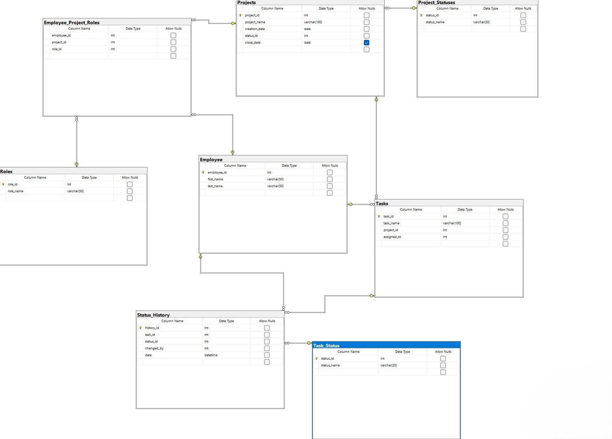

# Project Task Management DB

A normalized relational database schema for a company managing projects, employees, tasks, and roles. Built using SQL Server with support for detailed tracking of task statuses and employee assignments.

---

## 📐 ER Diagram

---

## 🧱 Schema Overview

- **Employees** — Stores employee personal information.
- **Projects** — Contains metadata for each project.
- **Roles** — Company roles like Developer, Manager, etc.
- **Employee_Project_Roles** — Many-to-many mapping with role per project.
- **Tasks** — Work units under each project, assigned to employees.
- **Task_Status** — Lookup table of task statuses (open, done, etc.).
- **Status_History** — Tracks changes to task statuses (who, when, what).
- **Project_Statuses** — Lookup for open/closed status of projects.

---

## 📁 File Structure

| Folder        | File                     | Description                             |
|---------------|--------------------------|-----------------------------------------|
| schema/       | create_tables.sql        | All `CREATE TABLE` statements           |
|               | er_diagram.jpg           | Schema image (ER Diagram)               |
| data/         | insert_data.sql          | Mock data for employees, projects, etc. |
| queries/      | queries.sql              | All SELECT queries from tasks           |

---

## 📌 Tasks Covered (SQL Examples)

1. List roles + count of employees
2. Roles without employees
3. Project list with roles and counts
4. Average tasks per employee per project
5. Project duration (create to close date)
6. Employees with fewest open tasks
7. Most overdue open tasks
8. Count of tasks not started per project
9. Auto-close projects where all tasks closed
10. Employees with no open tasks
11. Assign task to employee with fewest open ones

---

## ⚙ Tech Stack

- SQL Server 2022 (tested)
- SQL Workbench for visualization
- ER diagram generated via SSMS

---

## 🚀 How to Run

1. Open SQL Server Management Studio
2. Execute `schema/create_tables.sql`
3. Execute `data/insert_data.sql`
4. Run queries from `queries/select_queries.sql` to test functionality

---

